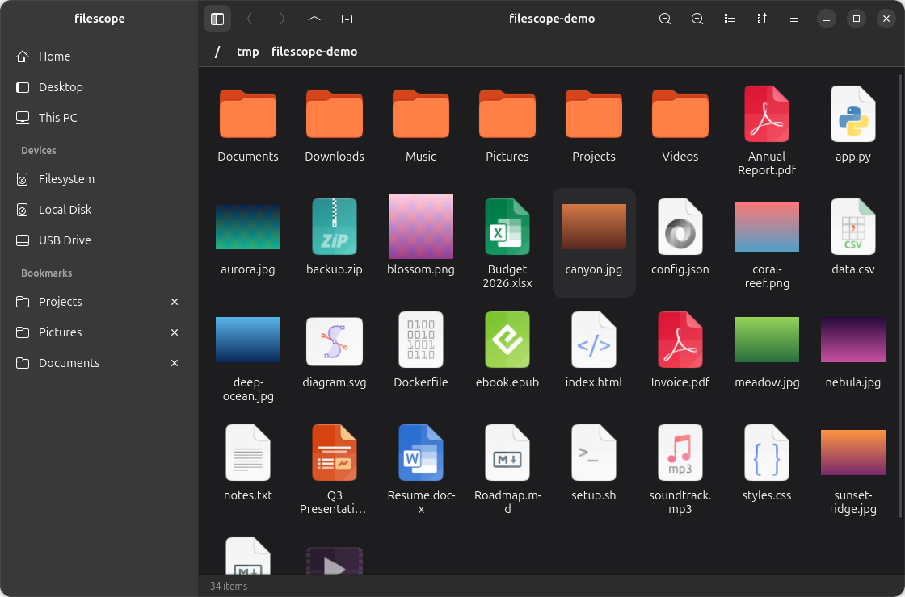
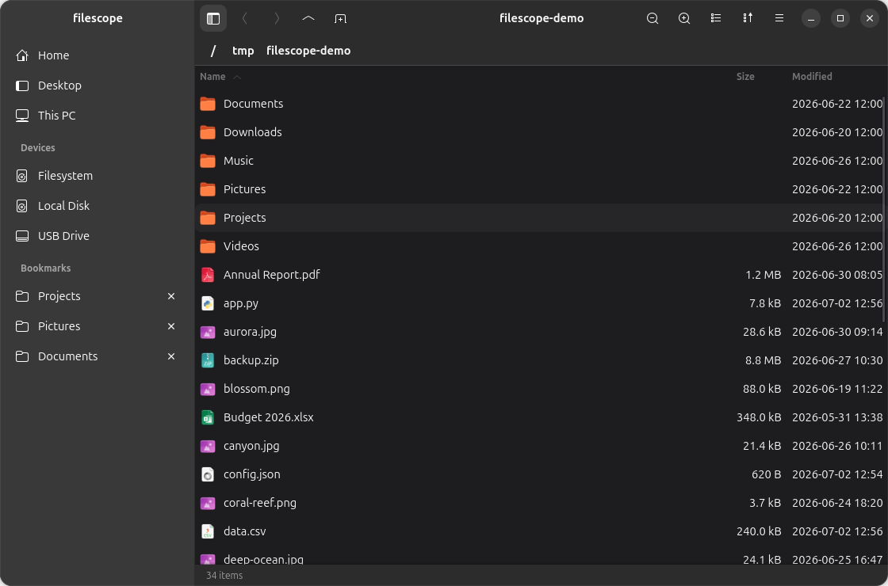

# filescope

A fast, nice-looking **file manager** for Linux. Browse your files as a spacious
icon grid or a detailed list, open tabs, preview with Space, mount drives (NTFS
included), and manage files — all with a native GNOME look that follows your
GTK/icon theme.

Built with **Rust + GTK4 + libadwaita**.


## Screenshots

<p align="center">
  
</p>
<p align="center"><em>Icon grid with live image thumbnails, and a places / bookmarks / devices sidebar.</em></p>

<p align="center">
  
</p>
<p align="center"><em>Sortable detailed list view — Name / Size / Modified, folders first.</em></p>

> Screenshots use a synthetic demo folder — no real files.

## What it does

- **Places + bookmarks + devices sidebar** — Home and your XDG folders, a
  **This PC** overview, your **bookmarks** (Nautilus-style, Ctrl+D to add), and a
  live **Devices** list of every drive/partition.
- **Tabs** — each tab is an independent folder with its own history and
  breadcrumb (Ctrl+T new, Ctrl+W close).
- **Grid & list views** with **zoom in/out** (Ctrl +/−) — large icons and real
  **image thumbnails** (decoded off the UI thread, so image folders never hang),
  or a sortable Name / Size / Modified list.
- **Space to preview** — macOS Quick-Look style: press Space on a file for an
  instant image / text / info preview; Space or Escape dismisses it.
- **This PC** — a Windows-Explorer-style drives overview with a capacity bar and
  "X free of Y" for each volume.
- **Mount & unmount drives** — click an unmounted partition to mount it; NTFS
  volumes fall back to **ntfs-3g** automatically when the system mount can't
  handle them. Eject/unmount from the sidebar.
- **File operations** — copy, cut, paste, rename, new folder, move-to-Trash,
  permanent delete, properties, open, and open-with — from the toolbar,
  right-click menu, or keyboard.
- **Theming** — file icons follow your **icon theme**; libadwaita follows the
  system **light/dark** preference and **accent colour**.

## Keyboard shortcuts

| | |
|---|---|
| `Alt+←` / `Alt+→` / `Alt+↑` | Back / Forward / Up |
| `Enter` / double-click | Open |
| `Space` | Preview (Quick Look) |
| `Ctrl+C` / `Ctrl+X` / `Ctrl+V` | Copy / Cut / Paste |
| `F2` | Rename |
| `Delete` / `Shift+Delete` | Trash / Delete permanently |
| `Ctrl+Shift+N` | New folder |
| `Ctrl+T` / `Ctrl+W` | New tab / Close tab |
| `Ctrl+A` | Select all |
| `Ctrl+H` | Show hidden files |
| `Ctrl+D` | Bookmark this folder |
| `Ctrl++` / `Ctrl+-` | Zoom in / out |
| `Ctrl+L` | Edit path |
| `F5` / `Ctrl+R` | Refresh |

## Install (prebuilt — no build tools needed)

Grab the latest tarball from the [**Releases**](../../releases) page and run its
installer. You only need a modern GNOME desktop (GTK 4.16+ / libadwaita 1.5+
runtime, e.g. GNOME 46+) — **no compiler, no Rust, no `-dev` packages**:

```sh
tar -xzf filescope-*-x86_64-linux.tar.gz
cd filescope-*-x86_64-linux
./install.sh          # installs to ~/.local, no root
```

Then search **filescope** in the Activities Overview, or run `filescope`. Prefer
not to install? Just run `./filescope` from the extracted folder. Remove it with
`./install.sh --uninstall`.

> Mounting **NTFS** drives via the fallback path uses `ntfs-3g` (and `pkexec` for
> the auth prompt) — install the `ntfs-3g` package if your distro doesn't ship it.

## Build & run

Building **from source** requires the GTK4 and libadwaita development packages:

```sh
sudo apt-get install -y build-essential pkg-config libgtk-4-dev libadwaita-1-dev
```

Then:

```sh
cargo run                       # launch (opens This PC)
cargo run -- ~/Downloads        # launch and open a folder
cargo build --release
```

### Install as a desktop app (from source)

```sh
./install.sh             # build in release + install the launcher and icon
./install.sh --uninstall # remove them again
```

This builds the release binary and drops it, a `.desktop` launcher, and the app
icon under your per-user XDG directories (`~/.local/bin`,
`~/.local/share/applications`, `~/.local/share/icons`) — no root required. The
launcher uses the app's own ID (`dev.filescope.Filescope`) and registers
filescope as a folder handler, so you can also *Open With → filescope* on a
folder.

## Test

```sh
cargo test
```

### Capturing a screenshot

Set `FILESCOPE_SHOT` to render the window to a PNG in-process and exit — handy on
systems where the compositor blocks normal screenshots. `FILESCOPE_SHOT_VIEW`
(`grid` | `list` | `computer`) picks the view, and `FILESCOPE_DEMO=1` swaps in
synthetic drives so nothing real is captured:

```sh
FILESCOPE_SHOT=/tmp/grid.png FILESCOPE_SHOT_VIEW=grid FILESCOPE_DEMO=1 \
  cargo run -- /path/to/a/demo/folder
```

## License

filescope is free software, licensed under the **GNU General Public License
v3.0 or later** (`GPL-3.0-or-later`). See [`LICENSE`](LICENSE) for the full text.

Copyright (C) 2026 filescope contributors
